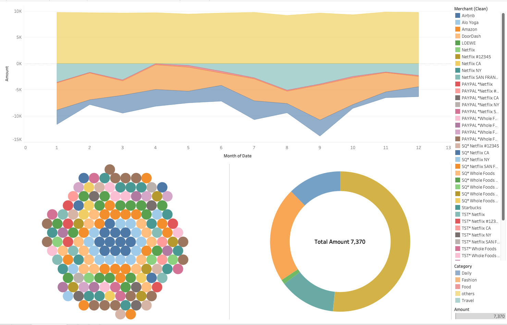

# Personal BI & Data Engineering Lab

A modern end-to-end Data Engineering and Business Intelligence ecosystem. This project demonstrates a production-grade data stack for personal finance and lifestyle analytics.

## 🚀 Project Overview
This project simulates a professional data lifecycle: from synthetic data generation and orchestration to containerized storage and interactive visualization. It serves as a digital twin for personal expense monitoring.

## 📊 Visual Analytics & Dashboard
### [View Interactive Dashboard on Tableau Public](https://public.tableau.com/views/Alex_Financial_dashboard/Dashboard1?:language=en-US&:sid=&:redirect=auth&:display_count=n&:origin=viz_share_link)

*The dashboard above visualizes the annual spending patterns of the synthetic user 'Alex', highlighting a major cash flow wall in September and clear lifestyle clusters in the fashion and daily retail sectors.*

## 🏗️ Technical Architecture
The pipeline is structured as a Directed Acyclic Graph (DAG):
1. **Source (Python/Faker)**: Generates synthetic transactions and payroll data.
2. **Orchestration (Dagster)**: Coordinates the flow from Python scripts to the database.
3. **Storage (PostgreSQL)**: Stores raw data in a relational format.
4. **Presentation (Tableau)**: Visualizes cash flow, spending categories, and lifestyle habits.

## 🛠️ Tech Stack
- **Languages**: Python 3.13
- **Orchestration**: Dagster
- **Database**: PostgreSQL (Docker)
- **Data Manipulation**: Pandas, SQLAlchemy
- **Visualization**: Tableau Public

## 🏁 Getting Started
1. **Start the database**: `docker compose up -d`
2. **Install dependencies**: `pip install dagster dagster-webserver pandas sqlalchemy psycopg2-binary faker`
3. **Launch Dagster UI**: `dagster dev -f orchestration/definitions.py`
4. Access the UI at `http://localhost:3000` and click **"Materialize All"**.

## 🔮 Roadmap
- [ ] Integration with real-time Stock Market APIs (`yfinance`).
- [ ] Correlation analysis between Fitness (gym check-ins) and dining habits.